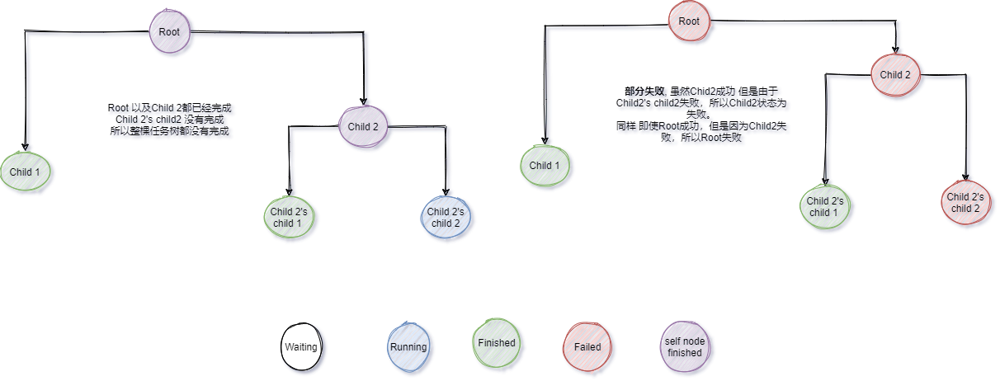

# JobTrackerX.Orleans
[ ](https://www.jetbrains.com/?from=JobTracker.Orleans)  [](https://www.nuget.org/packages/JobTrackerX.Client/)

[](https://hub.docker.com/repository/docker/itoktsnhc/jobtracker)

 基于Azure Container Instance 的 Demo站点: http://itok-jobtracker.eastasia.azurecontainer.io/
## 简介

**基于[Orleans](https://github.com/dotnet/orleans)框架实现的任务状态跟踪系统。**

Orleans实现了[Virtual Actor](http://research.microsoft.com/apps/pubs/default.aspx?id=210931)(在Orleans中Actor称之为Grain)模型，Virtual Actor(Grain)模型在Actor模型的基础上屏蔽了Actor的生命周期管理,类似各类语言中的垃圾回收。具有以下特性

- Grain 的Active → Deactivate 对使用方透明。Grain永远存在。Orleans Runtime 负责管理Grain的生命周期
- Grain在整个Orleans Cluster (Silos) 中只存在一个实例，使用GrainId标记，可以通过GrainId获得Grain的实例，然后执行Grain暴露出来的方法
- Grain对于请求单线程处理，不存在并发。
- Grain在Active后State存在于内存中，可选持久化。

JobTrackerX基于Orleans项目，实现了以下功能：

- Job与job之间存在树状关系:

    ```
                 root
                /    \
               /      \
              /        \
           child1      child2
          /      \
         /        \
    child1Child1  child1Child2
    ```

- Job各自有状态 : [WaitingToRun,Running,WaitingForChildrenToComplete,Faulted,RanToCompletion]
    - Job的状态只有 **当前Job状态** 和其 **所有子Job状态** 都转换为 **完成[Faulted , RanToCompletion]** 时才会记作完成,
    - Job和子任务任意一个存在**错误**，则当前Job状态为错误.
    - Job和子任务都为成功时，Job状态显示为成功。
- 对外的回调：
    - 可以指定当任务状态变化为某一特定状态时，调用特定的API
    - 可以指定在未来的某一个时间检查任务状态是否与设定的一系列任务状态相匹配，[匹配，不匹配]→执行特定的API



## 使用

### 应用场景
需要记录/跟踪任务状态的场景，任务间有从属/关联关系的情况

### 部署
当前集成模式为[Asp.Net Core Co-Hosting](https://devblogs.microsoft.com/dotnet/orleans-3-0/#co-hosting-via-the-generic-host)将Orleans和对外暴露Api接口的asp.net core项目组合在同一个 generic host上,简化部署模式
一个Orleans集群由一个或多个Silo组成。每个Silo开放两个端口:silo port,gateway port 用作集群内互相通信,集群信息使用Clustering Membership管理。JobTrackerX 中使用的时Azure Storage Table 作为集群信息的存储. 启动时每个Silo会将自己的信息同步到Membership table中，根据membership中的记录尝试互相连通(gossip)，组成集群。当接收到外部请求，Orleans Runtime 会依照一定的负载均衡规则将请求转发给特定的Silo上对应的Grain，如果Grain未激活，则runtime 会根据一定的规则将其激活在集群内的某一个Silo上.  


当外部请求通过反向代理访问到其中某一台机器上的Web API(假设Server1)时，Web Api 会通过连接到(通过Orleans-Client)当前机器的Silo1处理请求：
1. 如果目标Grain在Silo1上已经被激活，则直接在Silo1内处理。
2. 如果在其他机器上被激活(Silo2)则对应的请求将会被给到Silo2处理。
3. 如果对应的Grain未激活，则按照各个Silo节点的繁忙程度选择一个Silo来激活对应的Grain

部署时需要确保每个Silo的宿主(机器/pod)对应的silo两个端口可以互相访问。

- 外部依赖
	- Azure Storage Table作为主要的Grain State存储以及Clustering Membership 存储
	- Azure Service Bus Queue作为消息通知以及对外回调相关功能实现的基础。
	- Azure Storage Blob 作为Root Job索引的存储.
- 部署方式
	- k8s:作为deployment部署。各个silo pod间需要互相访问
	- bare metal:需要开放Silo所需要的多个port，单节点时不需要
- 性能指标，以下性能指标基于单台2c7g的 Azure Standard D2 v2，使用Azure Storage Table作为Grain State存储
	- 增
		- 不同Root Job: ~1000 job/s 
			- 任务之间没有关联，性能上限取决于Grain State存储的IOPS  **O(1)**
		- 相同Root Job: ~200 job/s(使用批量新增API)
			- 任务之间存在关联，性能上限取决于Root Job Grain State的单线程刷新速度。使用批量新增API合并请求可以加速。**O(N)**
	- 改: ~1000 jobs/s
		- 如果涉及到关联Parent Job的状态更新，取决于需要向上冒泡更新的Parent Job层数 **O(depth)**
		- 不涉及关联Parent Job状态更新, **O(1)**
	- 查: 取决于任务树深度以及每层任务数量。单纯读取任务~1000 job/s
		- 单任务 **O(1)**
		- 整棵任务树 **O(N^d)**

- 使用情况
	- 使用单台2c7g的 Azure Standard D2 v2部署，CPU占用在60%以下，内存占用在50%左右
	- 爬虫任务：100w量级爬取任务的状态追踪、级联更新未遇到明显问题。
	- 峰值 rps 700~800

### 使用方法
提供了C# sdk + web Api
- web api 
- [C# sdk](https://www.nuget.org/packages/JobTrackerX.Client/)

### 代码示例：


子任务触发状态变化

``` csharp

public async Task TestChildrenTrigger()
{
    var rootJob = await _client.CreateNewJobAsync(new AddJobDto {JobName = "TestChildrenTrigger"});
    Console.WriteLine($"RootJobId {rootJob.JobId}");
    await _client.UpdateJobStatesAsync(rootJob.JobId,
        new UpdateJobStateDto(JobState.Running, "rootJobRunning"));
    var child1 = await _client.CreateNewJobAsync(new AddJobDto("child1", rootJob.JobId));
    var child2 = await _client.CreateNewJobAsync(new AddJobDto("child2", rootJob.JobId));
    await _client.UpdateJobStatesAsync(rootJob.JobId,
        new UpdateJobStateDto(JobState.RanToCompletion, "rootJobFinished"));
    await _client.UpdateJobStatesAsync(rootJob.JobId,
        new UpdateJobStateDto(JobState.Running, "rootJobRunningAgain"));
    await _client.UpdateJobStatesAsync(rootJob.JobId,
        new UpdateJobStateDto(JobState.RanToCompletion, "rootJobFinished"));
    rootJob = await _client.GetJobEntityAsync(rootJob.JobId);
    Assert.AreEqual(JobState.WaitingForChildrenToComplete, rootJob.CurrentJobState);

    await _client.UpdateJobStatesAsync(child1.JobId, new UpdateJobStateDto(JobState.Warning, "child1 Running"));
    await _client.UpdateJobStatesAsync(child2.JobId, new UpdateJobStateDto(JobState.Running, "child2 Running"));

    await _client.UpdateJobStatesAsync(child1.JobId,
        new UpdateJobStateDto(JobState.RanToCompletion, "child1 finished"));
    await _client.UpdateJobStatesAsync(child2.JobId,
        new UpdateJobStateDto(JobState.RanToCompletion, "child2 finished"));

    child1 = await _client.GetJobEntityAsync(child1.JobId);
    child2 = await _client.GetJobEntityAsync(child2.JobId);
    rootJob = await _client.GetJobEntityAsync(rootJob.JobId);
    Assert.AreEqual(JobState.RanToCompletion, rootJob.CurrentJobState);
    Assert.AreEqual(JobState.RanToCompletion, child1.CurrentJobState);
    Assert.AreEqual(JobState.RanToCompletion, child2.CurrentJobState);
}
```

多层任务
``` csharp
public async Task TestMultiLayer()
{
	var root = await _client.CreateNewJobAsync(new AddJobDto("TestMultiLayer"));
	var layer1Child1 = await _client.CreateNewJobAsync(new AddJobDto("", root.JobId));
	var layer2Child1 = await _client.CreateNewJobAsync(new AddJobDto("", layer1Child1.JobId));
	var layer2Child2 = await _client.CreateNewJobAsync(new AddJobDto("", layer1Child1.JobId));
	var layer2Child3 = await _client.CreateNewJobAsync(new AddJobDto("", layer1Child1.JobId));
	var layer1Child2 = await _client.CreateNewJobAsync(new AddJobDto("", root.JobId));
	Console.WriteLine($"RootJobId {root.JobId}");

	await _client.UpdateJobStatesAsync(root.JobId, new UpdateJobStateDto(JobState.RanToCompletion));
	await _client.UpdateJobStatesAsync(layer1Child1.JobId, new UpdateJobStateDto(JobState.RanToCompletion));
	await _client.UpdateJobStatesAsync(layer1Child2.JobId, new UpdateJobStateDto(JobState.RanToCompletion));
	await _client.UpdateJobStatesAsync(layer2Child1.JobId, new UpdateJobStateDto(JobState.RanToCompletion));

	root = await _client.GetJobEntityAsync(root.JobId);
	Assert.AreEqual(JobState.WaitingForChildrenToComplete, root.CurrentJobState);
	await _client.UpdateJobStatesAsync(layer2Child2.JobId, new UpdateJobStateDto(JobState.Faulted));
	root = await _client.GetJobEntityAsync(root.JobId);
	Assert.AreEqual(JobState.WaitingForChildrenToComplete, root.CurrentJobState);
	await _client.UpdateJobStatesAsync(layer2Child3.JobId, new UpdateJobStateDto(JobState.RanToCompletion));
	root = await _client.GetJobEntityAsync(root.JobId);
	Assert.AreEqual(JobState.Faulted, root.CurrentJobState);
}
```

任务状态触发
``` csharp
public async Task TestEmailActionTriggerAsync()
{
	var root = await _client.CreateNewJobAsync(new AddJobDto("TestEmailActionTriggerAsync")
	{
		ActionConfigs = new List<ActionConfig>()
		{
			new ActionConfig()
			{
				JobStateFilters = new List<JobState>() {JobState.RanToCompletion, JobState.Running},//目标状态
				ActionWrapper = new ActionConfigWrapper()
				{
					EmailConfig = new EmailActionConfig()
					{
						Recipients = new List<string>() {"foo@bar.com"}
					},
					 HttpConfig = new HttpActionConfig()
					 {
						Headers = new Dictionary<string, string>() {{"x-test", "val"}},
						Payload = new {Name = "this isName", Value = "this is Val"},
						UseHMac = true,
						Url = "http://example.com"
					 }
				}
			}
		}
	});
	await _client.UpdateJobStatesAsync(root.JobId, new UpdateJobStateDto(JobState.Running));
	await _client.UpdateJobStatesAsync(root.JobId, new UpdateJobStateDto(JobState.RanToCompletion));
}

```

任务状态检查
```c#
public async Task TestStateCheckAsync()
{
	await _client.CreateNewJobAsync(new AddJobDto()
	{
		JobName = nameof(TestStateCheckAsync),
		StateCheckConfigs = new List<StateCheckConfig>()
		{
			new StateCheckConfig()
			{
				CheckTime = DateTimeOffset.Now.AddSeconds(15),
				FailedAction = new ActionConfigWrapper()
				{
					EmailConfig = new EmailActionConfig()
					{
						Ccs = new List<string>() {"foo@bar.com"},
						Recipients = new List<string>() {"foo@bar1.com"}
					}
				},
				TargetStateList = new List<JobState>()
				{
					JobState.Faulted,
					JobState.RanToCompletion
				}
			}
		}
	});
	var success = await _client.CreateNewJobAsync(new AddJobDto()
	{
		JobName = nameof(TestStateCheckAsync),
		StateCheckConfigs = new List<StateCheckConfig>()
		{
			new StateCheckConfig()
			{
				CheckTime = DateTimeOffset.Now.AddSeconds(15),
				SuccessfulAction = new ActionConfigWrapper()
				{
					EmailConfig = new EmailActionConfig()
					{
						Ccs = new List<string>() {"foo@bar.com"},
						Recipients = new List<string>() {"foo@bar1.com"}
					}
				},
				TargetStateList = new List<JobState>()
				{
					JobState.Faulted,
					JobState.RanToCompletion
				}
			}
		}
	});
	await _client.UpdateJobStatesAsync(success.JobId, new UpdateJobStateDto(JobState.Faulted));
}
```


## 实现

### 组成

- JobId生成模块：JobIdGrain
    - Job拥有唯一，递增的JobId。可以通过JobId获取/操作Job
- Job状态管理模块：JobGrain
    - 实现Job间关系的记录。任务状态的保存。
- RootJob索引管理模块：AggregateJobIndexGrain
    - 用于展现在首页。提供有限维度的搜索。
- 节点计数模块
- 对外
    - BlazorServerSide实现的UI
    - c#客户端SDK
    - web api
    - 对外的API调用

### 

### 细节

- JobId生成
    - 基于**预先分配ID段**的方式实现，初始化设定Id Range Seed =0，id scale= 2000,id Offset值
    - 从存储中取得上次分配的Id Range Seed，创建当前Id Range为 [seed*scale,(seed+1)*scale) 如[0,2000) 、[2000,4000)等。内存中记录[当前值:_idState,range start,range end](初始化为 id range start)，每次分配出去_idState++
    - 当已分配出去的Id == id range end ，++ id range seed 写入存储。更新内存中状态。
    - 最终获取到的JobId = jobId+ offset，这样如果需要调整JobId，直接修改Offset即可
- Job状态管理
    - JobState为任务的状态
        - Job从未被激活过→WaitingForActivation, 初始状态
        - Job仅被激活(创建)→WaitingToRun
        - Job运行中→Running
        - 任务已完成→[Faulted, RanToCompletion]
        - 当前任务已完成，等待子任务完成→WaitingForChildrenToComplete
    - 所有任务状态的更新会**追加**到StateChanges数组中
        - 当前任务的状态由StateChanges和Children JobStateCategories 一起计算得到
    - 任务状态可以分类为(JobStateCategory)
        - Pending→等待完成，包含WaitingToRun, Running, WaitingForChildrenToComplete
        - Successful→成功→RanToCompletion
        - Failed→失败→Faulted
    - ChildJob的JobState变化会按照冒泡形式调用ParentJob.OnChildStateChange()
        - 子任务会计算状态更新前后的JobStateCategory,只有在更新前后对应的Category不相同，才会调用ParentJob.OnChildStateChange()，降低冒泡的次数
    - ParentJob中会存下所有Children的JobStateCategrory状态，并依照这些JobStateCategory得出子任务是否都完成[成功，失败]，可以给出有多少子任务在等待、运行中、已完成
- RootJob索引
    - RootJob为Job.ParentJobId==null的任务
    - 创建RootJob时，通过Job信息，生成JobIndices对象(包含Job基础信息)，同时按照时间(yyyyMMdd)+JobId为PK写入Azure Storage Table中.(利用Table整体的高IOPS)
    - 后台服务定时(~n min)从table中抽取当前时间小时+当前时间上一个小时的所有索引。通过以小时数为Key的AggrJobIndexGrain Merge压缩持久化到Blob中。然后清理此周期内Table内的Indices
        - AggrJobIndexGrain在持久化到Blob时采用 offset+多Blob文件的形式[offset(5):[file1,file1,file2,file3,file4]]，当文件大小达到一定程度，滚动offset值,将写入指向最新的Blob文件。降低每次Merge操作更新Blob的文件大小。
    - 前端从AggrJobIndexGrain获取数据，展示当前小时数+上一个小时数内的跟任务索引。
    - 前端对外提供有限时间内部分维度的查询。
- 对外操作模块
    - 状态检查→使用AzureServiceBus的Queue的ScheduledMessage功能实现
    - 状态通知→当任务状态变化的时候，检查任务状态，如果命中则像ServiceBusQueue发送消息
    - 后台服务监听ServiceBusQueue，实现调用外部API逻辑。
- 计数模块
    - 两级结构：
        - AggregateCounterGrain→聚合CounterGrain的对外统一接口Grain,有配置maxInternalCounter,Aggr为StatelessWorker，可以由多个副本。
        - CounterGrain→实际计数的Grain，每次+1后写入AzureStorage
    - AggrCounter在接到+n请求后通过随机数找到Id为aggrCounterGrainId+rand.Next(maxInternalCounter) 的CounterGrain，调用他的+n方法。
    - AggrCounter在读取时将会向[0,maxInternalCounter]的CounterGrain发送读取当前计数的请求。Sum后返回。
    - 主要解决AzureStorage单个对象的IOPS偏低，如单个Blob的写入IOPS约20~50,使用两级结构计数就可以得到maxInternalCounter+SingleIOPS的总IOPS吞吐，而在读取的时候，由于对应的CounterGrain常驻内存。所以读取也不会存在瓶颈。
